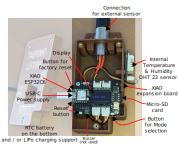
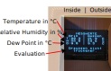
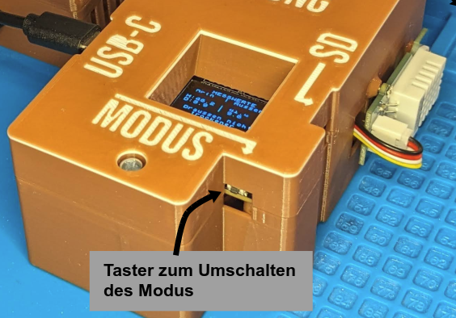
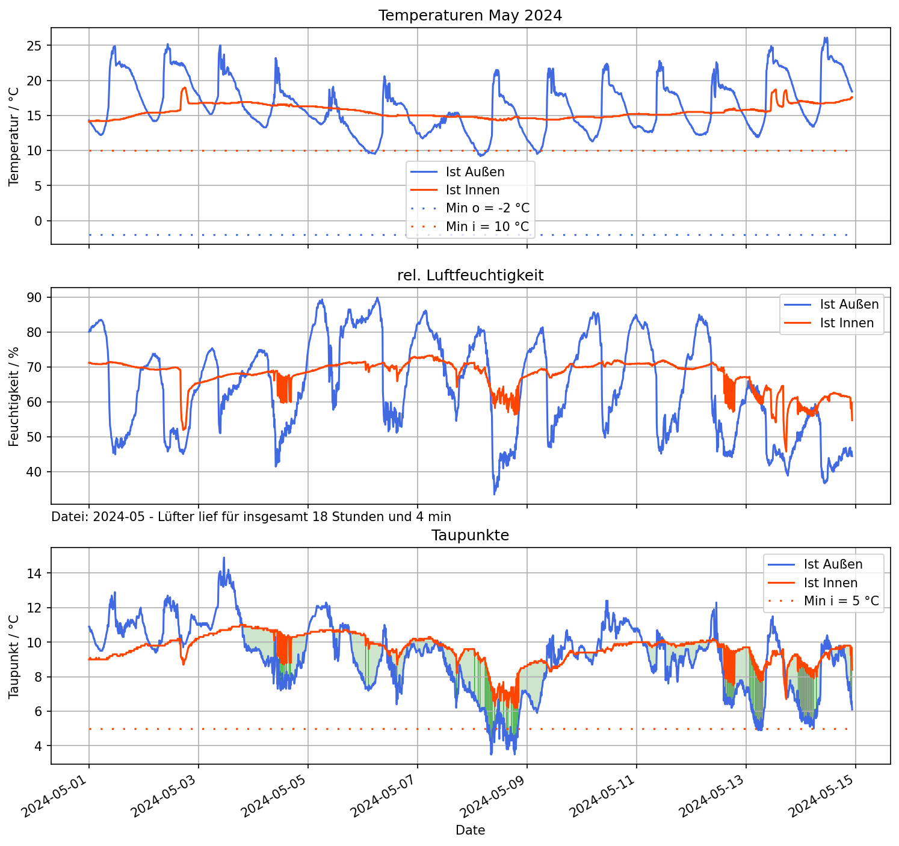

# Dew-Point-Ventilation-Zigbee
Dew Point Ventilation based on Zigbee with ESP32C6

This repository contains the source code for a dew point ventilator as initially described here by german MAKE magazin: [Taupunktluefter](https://github.com/MakeMagazinDE/Taupunktluefter). A short overview is also given below.

# Instructions for the dew point ventilator
These instructions describe a dew point ventilation system. This system is used to measure the humidity of the air at two locations. If the air outside is drier in absolute terms than inside, a fan is switched on. 

The following picture shows the components schematically:

The temperature is measured by an internal and external DHT22 sensor. The controll unit checks whether ventilation is useful and commands the socket via zigbee to turn on the fan for ventilation.

The individual components inside the control unit are described in more detail in the following image:

Check out the following 3d modelled parts:
- [Case for dew point ventilation with seeed xiao esp32c6 and DHT22](https://www.printables.com/model/1143678-case-for-dew-point-ventilation-with-seeed-xiao-esp)
- [Grove Temperature Humidity Sensor DHT22 case](https://www.printables.com/model/1145516-grove-temperature-humidity-sensor-dht22-case)

# Overview of the code provided

The code is intended to be compiled in vscode with platformio. The main programm logic can be found in the [main.cpp](DewPointFan/src/main.cpp) and is calling six helping classes, which can be found in the lib folder:
1. ProcessSensorData: Read the sensors, calculate the dewpoint and decide if ventilation is useful.
2. ControlFan: Handle the mode selection by the user and the duration of the fan being on or off.
3. ZigbeeSwitchHelper: Handles the zigbee communication with the mains socket, based on the Zigbee Arduino library.
4. RTCHelper: Sets the RTC if necessary and supplies the date information for display and logging.
5. SDhelper: Write data to the sd card in regular intervals
6. DispHelper: Show status information on the display.

Here is also a short sketch of the main idea:

# How to install with platformIO

You can use PlatformIO to flash the board with this fast steps. 
1. Install PlatformIO or [pioarduino](https://github.com/pioarduino/platform-espressif32/).
2. Clone this repo and open it in vscode.
3. The project should be configured automatically.
4. Click compile and upload -> Done

# Setup and commissioning
The outdoor sensor should be placed outside so that it can measure the air temperature and humidity of the outside air. A hanger is provided for this purpose.

The control unit should be mounted indoors and reach the outdoor sensor with the 3m long cable. The indoor sensor on the housing of the control unit should not be directly in the airflow of the future fan. It is better if it can measure the indoor temperature and humidity undisturbed.

The control unit is supplied with power using a cell phone power supply unit and a USB-C cable. When the power is connected, the device starts after 4s and shows information on the display.

The device always starts in automatic mode.

The device includes a switchable socket that works according to the Zigbee standard, as sold by Philips Hue or IKEA, for example.

# Operation in automatic mode

1. The inner and outer sensors are scanned alternately every two seconds. The air temperature and relative humidity are determined. 
2. Eight pairs of values are averaged so that decisions are based on approximately half a minute and not on individual values.
3. The dew point temperature is calculated from the relative humidity and the temperature. The dew point temperature is a measure of the absolute amount of moisture in the air. 
4. If the answers to the following four questions are yes, ventilation makes sense - otherwise not!
   - Is the temperature inside above 10°C?
   - Is the temperature outside above -2°C?
   - Is the dew point inside above 5°C?
   - Is the dew point outside 5°C lower than inside? It only makes sense to ventilate If it is noticeably drier outside than inside!
5. If the appliance is in automatic mode (“AUTO”) and ventilation makes sense (see 4.) then the fan is switched on for 15 minutes.
6. As typical bathroom fans are not designed for continuous operation, the fan then switches off again for 10 minutes. 
7. After the 10 min break, the fan may be switched on again if ventilation makes sense.

# Temperature display
The measured values of the sensors can be read on the display of the control unit. On the left for the indoor sensor and on the right for the outdoor sensor.

1. Air temperature in °C
2. Relative humidity in percent
3. The dew point temperature in °C, which serves as a measure of the absolute humidity.
4. Evaluation of the conditions. This indicates whether ventilation makes sense or why it does not.

# Off, on and automatic mode

The mode of the device can be switched using the small recessed button.

The device always starts in automatic mode and shows this as “AUTO” on the display. 

When the button is pressed, the appliance switches to ON mode. Here the fan is always switched on for 15 minutes - is then switched off for 10 minutes and then starts again in any case.

If you press the button again and select the off mode (“OFF”), the fan will never start.

If you press the button a third time, you will return to automatic mode.

Regardless of the mode, the display always shows whether ventilation is theoretically useful.

# Recording the data on the SD card

The micro SD card can be clicked into place by pressing lightly on the right-hand side of the housing. This causes it to come out a few millimeters and can be removed.

The data on the SD card can be converted into a nice graphic using the appropriate program. 

The programm for visulation is not jet published... coming soon.

# Coupling a new socket outlet

A new zigbee device can be coupled for 180s after a reset of the controller. To delete old couplings a zigbee factory reset can be done with a long press on the boot button on the esp32c6.

# Components
| component | Approx. price |
| --- | --- |
| [ESP32-C6 by Seeed Studio](https://www.seeedstudio.com/Seeed-Studio-XIAO-ESP32C6-p-5884.html) | 6 € |
| [XIAO Expansion Board](https://wiki.seeedstudio.com/Seeeduino-XIAO-Expansion-Board) | [15 €](https://www.reichelt.de/de/de/shop/produkt/xiao_-_erweiterungboard_mit_oled-display-379735) |
| 2x [DHT22 Sensors](https://www.reichelt.de/de/de/shop/produkt/arduino_-_temp_feuchte_pro_praezise_dht22_am2302-191250) | 20 €| 
| [XLR socket](https://www.reichelt.de/de/de/shop/produkt/xlr-einbaustecker_3-polig_vernickelte_kontakte-40795) and cable | 5 € |
| SD card | 6 € | 
| 3D print | 15 € |
| Zigbee socket | 8 € | 
| Cell phone power supply + USB-C cable | 5 € | 
| __total__ | __80 €__ |

Obviously, additionally required:

- Bathroom fan